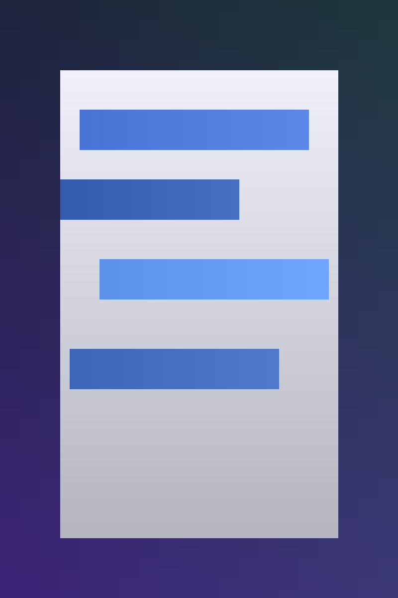
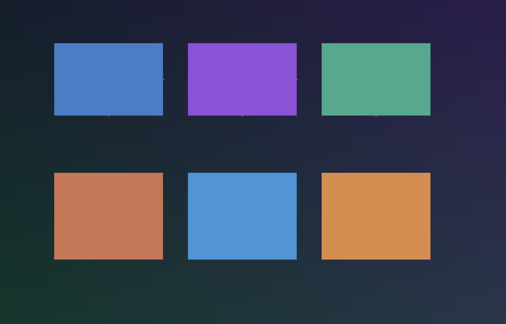

<p align="center">
  <a href="https://github.com/Arbor-Aid/Shieldmate/actions/workflows/ci.yml"></a>
  <a href="https://github.com/Arbor-Aid/Shieldmate/blob/main/LICENSE.md"></a>
  <a href="https://github.com/Arbor-Aid/Shieldmate/stargazers"></a>
  <a href="https://github.com/Arbor-Aid/Shieldmate/issues"></a>
</p>

# 🛡️ Shieldmate — The Autonomous Support Platform

Shieldmate orchestrates autonomous AI agents, Firebase, Dockerized Model Context Protocol (MCP) services, Slack workflows, and a Lovable.dev React + Flutter UI to deliver a mission-ready support platform.

---

## ✨ Screenshots

| Dashboard | Mobile | Architecture |
| --- | --- | --- |
|  |  |  |

---

## 🚀 Features

- 🤖 **Autonomous AI agents** coordinate tasks across domains.
- 🔥 **Firebase + Google Cloud backend** for auth, data, and serverless functions.
- 🐳 **Dockerized MCP services** deployable to Cloud Run.
- 💬 **Slack + Notion integrations** keep humans in the loop.
- ⚙️ **CI/CD workflows** with lint, tests, deploy, and health checks.
- 📊 **Google Workspace + Notion sync** for governance and visibility.

---

## ⚡ Quickstart

```bash
# Clone the repo
git clone https://github.com/Arbor-Aid/Shieldmate.git
cd Shieldmate

# Web frontend + services
npm install
npm run dev

# Flutter client
cd frontend/arbor_aid_app
flutter pub get
flutter run
```

---

## 🧠 Architecture


- **Frontend**: React + Vite UI, plus Flutter companion app.
- **MCP Services**: Docker containers for AI agents (Cloud Run ready).
- **Firebase**: Auth, Firestore, Functions, Storage, and Analytics.
- **Integrations**: Slack workflows, Notion dashboards, Google Workspace automations.

---

## 🗂️ Governance Snapshot

See the current compliance + automation posture in [`docs/governance_snapshot.md`](docs/governance_snapshot.md).

---

## 🤝 Contributing

- Follow CODEOWNERS review gates for frontend, backend MCPs, DevOps workflows, and sensitive configs.
- Open a feature branch from `main`, create a PR, and tag the relevant owners.
- All contributions run through CI, security checks, and branch protection rules.

---

## 📄 License

Released under the [MIT License](LICENSE.md).

---

## ⚡ Call to Action

**Deploy your own Shieldmate and let the AI agents do the work!**
